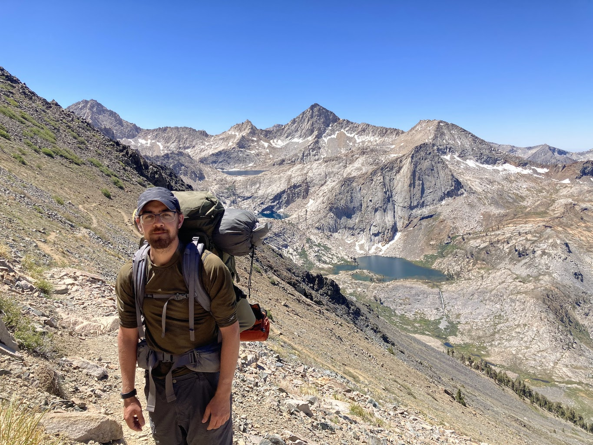

I'm a grad student in the [Moler Group](https://web.stanford.edu/group/moler) at Stanford University, working on scanning magnetic microscopy of quantum materials and devices using superconducting sensors.

My interests and [experiences](/cv/) include [scientific computing](https://github.com/loganbvh/), quantum sensors and [quantum computing](https://sequencing.readthedocs.io/), and [experimental low temperature physics](/publications/).

<em>Backpacking in Sequoia National Park, July 2022.</em>

I started my PhD in the of Kam Moler at Stanford in Sept. 2017. In Jan. 2019, after 1.5 years at Stanford, I paused my PhD program and took a job as a Research Associate at the superconducting quantum computing startup [Quantum Circuits, Inc.](https://quantumcircuits.com/) (QCI), which was spun out of the Applied Physics labs at Yale.

As an early employee at QCI, I worked on calibration and characterization of transmon qubits and high-Q cavities, automating the tuneup of these devices, and [numerical modeling](https://sequencing.readthedocs.io/en/latest/) to diagnose and optimize their performance. In Jan. 2021, after 2 years at QCI, I returned to the Moler group at Stanford to resume my PhD.

My time in the quantum computing industry/startup space provided not only the opportunity to learn the nuances of circuit QED, but also valuable perspective on the scaling and materials challenges associated with building high coherence superconducting quantum systems.

At Stanford my research focus has been on understanding the response of thin film superconductors to locally applied magnetic fields, including local studies of vortex dynamics at the level of single vortices. To this end, I have developed open source software tools that enable quantitative interpretation of measurements of [screening](https://superscreen.readthedocs.io/en/latest/index.html) and [nonlinear and dissipative](https://py-tdgl.readthedocs.io/en/latest/) effects in thin film superconducting devices at the micron and sub-micron scale.
