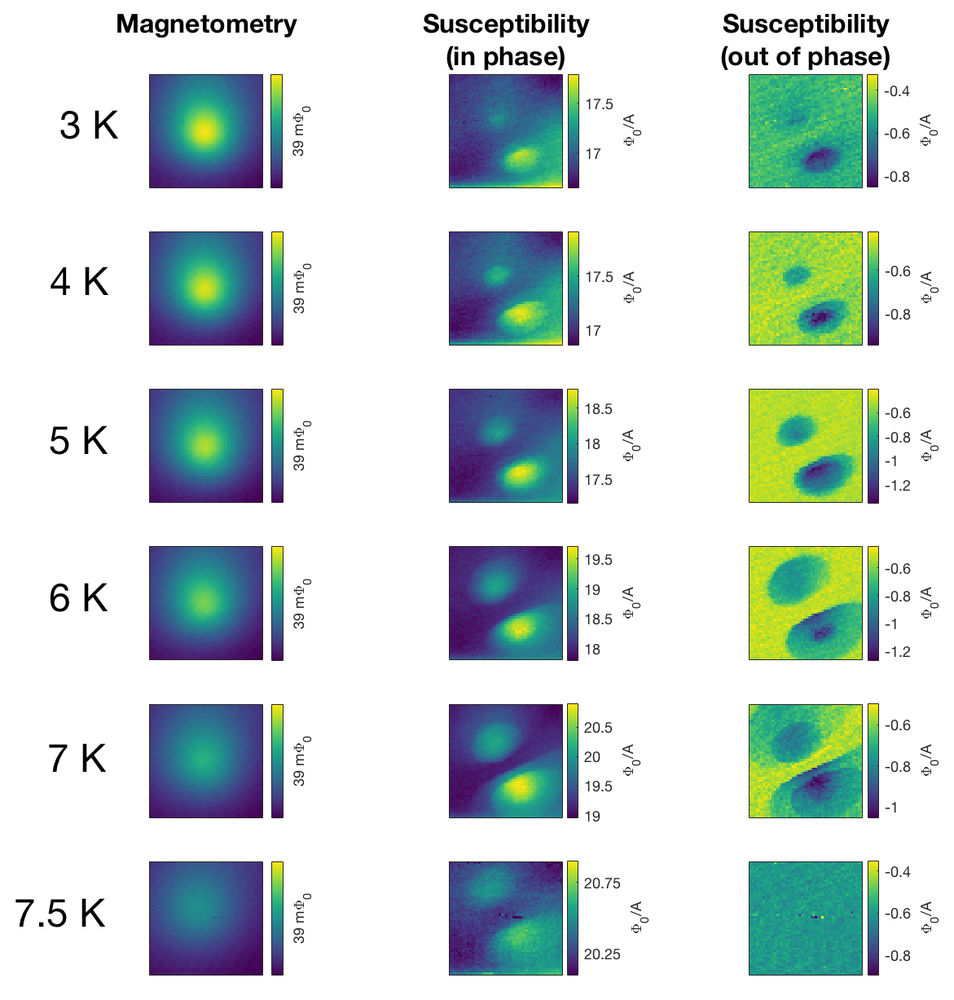

**Open access links**: [Publisher](https://link.aps.org/accepted/10.1103/PhysRevB.100.024514), [arXiv](https://arxiv.org/abs/1903.11542)

**Summary**: This paper describes measurements and modeling of anisotropic vortex pinning in the iron-based superconductor FeSe. I performed many of the scanning SQUID measurements in the early stages of this project, in which we observed disctinctive features (which we refer to as "butterflies") in maps of the magnetic response, or susceptibility, of the material (see image below). We identifies these butterflies as being due to vortex motion, with vortices preferentially moving along twin domain boundaries rather than across them. My colleague Irene then performed numerical simulations using a toy model of the vortex pinning potential to extract the anisotropic "spring constants" for the vortices.

