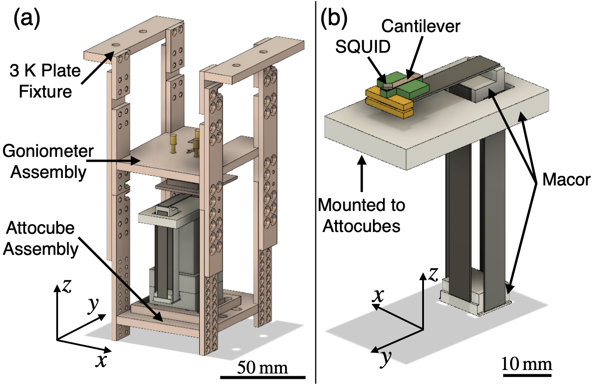

[Download paper here](https://loganbvh.github.io/files/1.5085008.pdf/)

Recommended citation: Logan Bishop-Van Horn, Zheng Cui, John R. Kirtley, and Kathryn A. Moler , "Cryogen-free variable temperature scanning SQUID microscope", Review of Scientific Instruments **90**, 063705 (2019) [https://doi.org/10.1063/1.5085008](https://doi.org/10.1063/1.5085008).