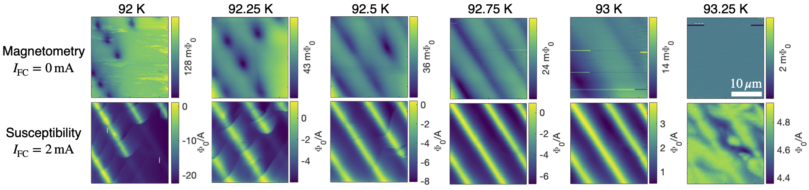

This paper describes the construction of a variable temperature [scanning SQUID microscope](https://en.wikipedia.org/wiki/Scanning_SQUID_microscopy) in a dry cryostat, enabling precision magnetometry and susceptometry at sample temperatures from 2.8 K to over 100 K. We demonstrated this capability by imaging [Abrikosov vortices](https://en.wikipedia.org/wiki/Abrikosov_vortex) and spatial inhomogeneity due to twin domains in optimally-doped [YBCO](https://en.wikipedia.org/wiki/Yttrium_barium_copper_oxide) through its critical temperature at roughly 93 K (see image below).

Open access links: [Publisher](https://doi.org/10.1063/1.5085008), [arXiv](https://arxiv.org/abs/1812.03215), [PDF](https://loganbvh.github.io/files/1.5085008.pdf/)
