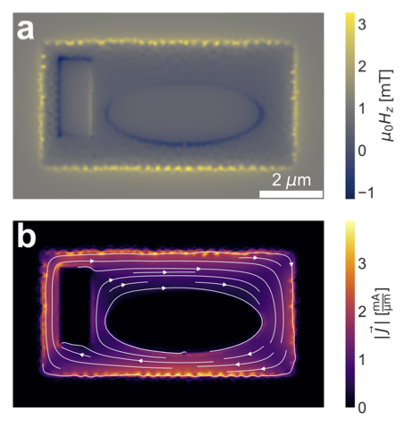

**Open access links**: [arXiv](https://arxiv.org/abs/2203.13388), [email me](mailto:lbvh@stanford.edu) for published version

**Summary**: Quantitative understanding of the spatial distribution of magnetic fields and Meissner screening currents in two-dimensional (2D) superconductors and mesoscopic thin film superconducting devices is critical to interpreting the results of magnetic measurements of such systems. This paper introduces SuperScreen, an open-source Python package for simulating the response of 2D superconductors to trapped flux and applied time-independent or quasi-DC magnetic fields for any value of the effective magnetic penetration depth, &Lambda;. Given an applied magnetic field, SuperScreen solves the 2D London equation using an efficient matrix inversion method to obtain the Meissner currents and magnetic fields in and around structures composed of one or more superconducting thin films of arbitrary geometry. SuperScreen can be used to model screening effects and calculate self- and mutual-inductance in thin film superconducting devices.

The image above shows the simulated magnetic field (panel a) and supercurrent density (panel b) in a superconducting thin film with two holes in the n=0 fluxoid state (or the Meissner state). See the caption of Figure 2 in the paper for a full description of the image.
