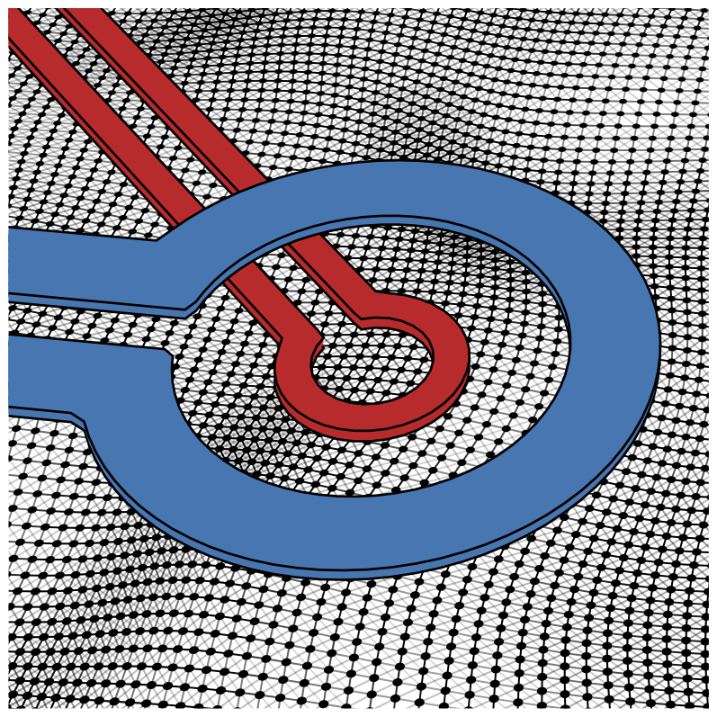

**Open access links**: [PDF](../files/PhysRevB.106.054521.pdf), [arXiv](https://arxiv.org/abs/2208.09084)

**Summary**: In this work, we study the effect of engineered disorder on the local magnetic response of proximity-coupled
superconducting island arrays by comparing scanning superconducting quantum interference device (SQUID)
susceptibility measurements to a model in which we treat the system as a network of one-dimensional (1D)
superconductor–normal-metal–superconductor Josephson junctions, each with a Josephson coupling energy <i>EJ</i>
determined by the junction length or distance between islands. We find that the disordered arrays exhibit a spatially inhomogeneous diamagnetic response which, for low local applied magnetic fields, is well described by this
junction network model, and we discuss these results as they relate to inhomogeneous 2D superconductors. Our
model of the static magnetic response of the arrays does not fully capture the onset of nonlinearity and dissipation
with increasing applied field, as these effects are associated with vortex motion due to the dynamic nature of the
scanning SQUID susceptometry measurement. This work demonstrates a model 2D superconducting system
with engineered disorder, and it highlights the impact of dissipation on the local magnetic properties of 2D
superconductors and Josephson junction arrays.
