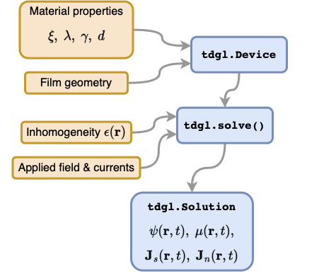

**Publisher link**: [10.1016/j.cpc.2023.108799](https://doi.org/10.1016/j.cpc.2023.108799)

**Open access link**: [arXiv:2302.03812](https://arxiv.org/abs/2302.03812)

**GitHub resository**: [github.com/loganbvh/py-tdgl](https://github.com/loganbvh/py-tdgl)

**Online ocumentation**: [py-tdgl.readthedocs.io](https://py-tdgl.readthedocs.io/en/latest/)

**Summary**: Time-dependent Ginzburg-Landau (TDGL) theory is a phenomenological model for the dynamics of superconducting systems. Due to its simplicity in comparison to microscopic theories and its effectiveness in describing the observed properties of the superconducting state, TDGL is widely used to interpret or explain measurements of superconducting devices. Here, we introduce 𝚙𝚢𝚃𝙳𝙶𝙻, a Python package that solves a generalized TDGL model for superconducting thin films of arbitrary geometry, enabling simulations of vortex and phase dynamics in mesoscopic superconducting devices. 𝚙𝚢𝚃𝙳𝙶𝙻 can model the nonlinear magnetic response and dynamics of multiply connected films, films with multiple current bias terminals, and films with a spatially inhomogeneous critical temperature. We demonstrate these capabilities by modeling quasi-equilibrium vortex distributions in irregularly shaped films, and the dynamics and current-voltage-field characteristics of nanoscale superconducting quantum interference devices (nanoSQUIDs).

<!--  -->
