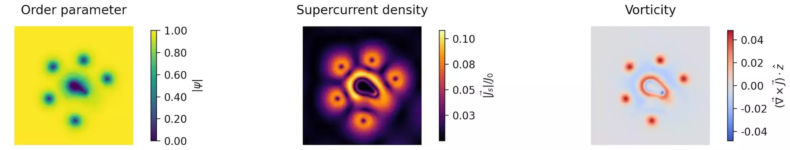

**Publisher link**: [10.1103/PhysRevB.107.224509](https://doi.org/10.1103/PhysRevB.107.224509)

**Open access link**: [arXiv:2304.13093](https://arxiv.org/abs/2304.13093)

**Associated GitHub resositories**:
- [loganbvh/vortex-dynamics-induced-by-scanning-squid](https://github.com/loganbvh/vortex-dynamics-induced-by-scanning-squid)
- [loganbvh/py-tdgl](https://github.com/loganbvh/py-tdgl)
- [loganbvh/superscreen](https://github.com/loganbvh/superscreen)

**Summary**: We measured the local magnetic response of a niobium thin film by applying a millitesla-scale AC magnetic field using a micron-scale field coil and detecting the response with a micron-scale pickup loop in a scanning superconducting quantum interference device (SQUID) susceptometry measurement. Near the film's critical temperature, we observed a step-like nonlinear and dissipative magnetic response due to the dynamics of a small number of vortex-antivortex pairs induced in the film by the local applied AC field. We modeled the dynamics of the measurement using a combined two-dimensional London-Maxwell and time-dependent Ginzburg-Landau approach, allowing us to construct a detailed real-space picture of the vortex motion causing the observed dissipative response. This work pushes scanning SQUID susceptometry of two-dimensional superconductors beyond the regime of linear response and lays the foundation for microscopic studies of vortex dynamics and pinning in superconducting devices and more exotic materials systems.
